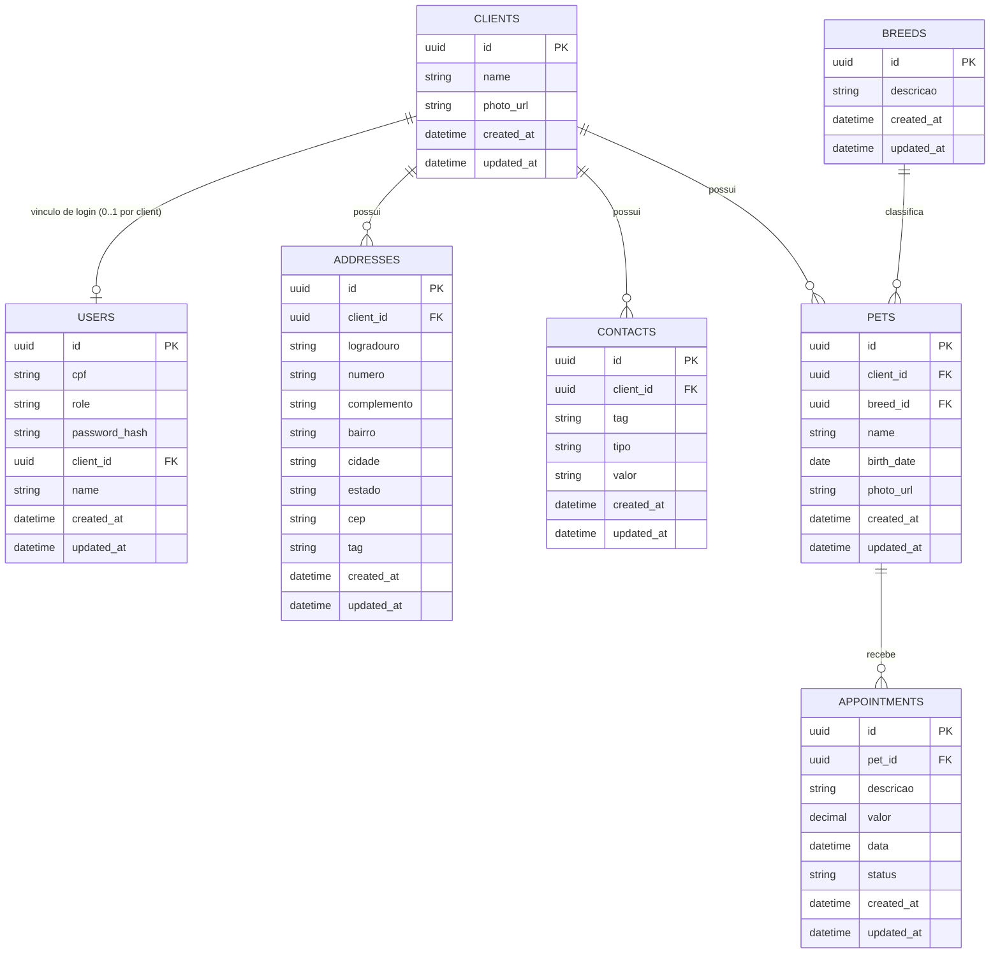

# Diagrama de Dados (Mermaid) — Estrutura Atual

## Regras de Integridade (complementares ao diagrama)
- `users.cpf`: `UNIQUE` e `NOT NULL`.
- `users.client_id`: `UNIQUE`, obrigatório para `CLIENTE`, nulo para `ADMIN`.
- `users.name`: obrigatório para `ADMIN`, nulo para `CLIENTE`.
- `breeds.descricao`: `UNIQUE`.
- `appointments.status`: enum com default `AGENDADO`.
